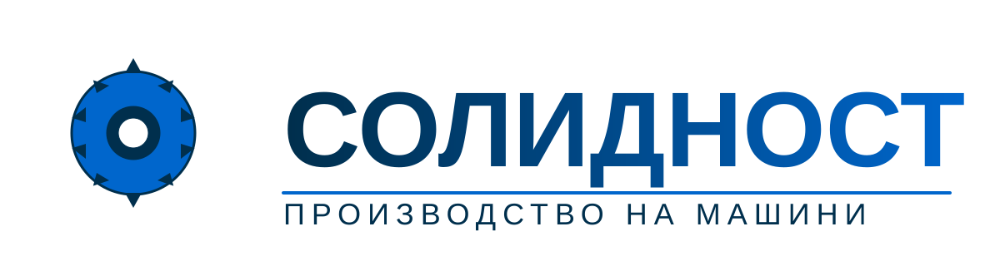

# Логота на Солидност

## Налични файлове

### Основно лого (SVG)
- **solidnost_logo.svg** - Векторен формат, висококачествено лого за всички размери
  - Размер: 1200x320px viewBox (скалируемо)
  - Използва се в: навигация, заглавки
  - Предимства: Перфектно качество на всяка резолюция, малък размер файл (2KB)

### PNG версии на основното лого
- **solidnost_logo.png** - Стандартна резолюция (1200x320px, 35KB)
- **solidnost_logo_2x.png** - 2x резолюция за Retina дисплеи (2400x640px, 73KB)
- **solidnost_logo_3x.png** - 3x резолюция за високо-резолюционни дисплеи (3600x960px, 114KB)

### Малко лого за футър
- **logo-s.png** - По-малка версия на логото (800x213px, 23KB)
  - Използва се в: футър, компактни области

### Favicon (иконка на сайта)
- **favicon.svg** - Векторна версия на иконката с джанта (512x512px viewBox)
- **favicon.png** - Стандартна иконка (32x32px, 1.2KB)
- **favicon_180.png** - Apple Touch Icon (180x180px, 8.5KB)
- **favicon_192.png** - Android Chrome иконка (192x192px, 9.2KB)
- **favicon_512.png** - Висока резолюция за PWA (512x512px, 30KB)

## Дизайн

Логото запазва оригиналния дизайн, но е подобрено за по-добро качество и яснота:

### Елементи на дизайна:
1. **Индустриална джанта** - символизира производство и прецизност
2. **Текст "СОЛИДНОСТ"** - с градиентно оцветяване в синьо
3. **Подпис** - "ПРОИЗВОДСТВО НА МАШИНИ"

### Цветова схема:
- **Тъмно синьо:** #002f4d
- **Светло синьо:** #0066cc
- **Бяло:** #ffffff (за акценти)

## Използване

### В HTML:
```html
<!-- Навигация - използвайте SVG за най-добро качество -->


<!-- Футър - малка PNG версия -->


<!-- Favicon в <head> -->
<link rel="icon" type="image/png" href="images/favicon.png">
<link rel="apple-touch-icon" href="images/favicon_180.png">
<link rel="icon" type="image/svg+xml" href="images/favicon.svg">
```

### Препоръки:
1. **Винаги използвайте SVG версията** когато е възможно за най-добро качество
2. **PNG версиите** са налични за съвместимост със стари браузъри или когато SVG не може да се използва
3. **Високо-резолюционните версии (2x, 3x)** могат да се използват за Retina дисплеи чрез `srcset`

### Пример за Retina дисплеи:
```html

```

## Подобрения

Това обновление включва:
- ✅ Почистен и подобрен SVG код за по-остри линии
- ✅ Оптимизирани пропорции на джантата
- ✅ Подобрена типография и разстояния
- ✅ Високо-резолюционни PNG експорти
- ✅ Допълнителни favicon размери за различни устройства
- ✅ Запазен оригинален дизайн концепт
- ✅ Добавено shape-rendering="geometricPrecision" за по-четки линии
- ✅ Подобрени border и stroke width за по-ясни контури
- ✅ Enhanced text-rendering properties за по-добро качество на текста
- ✅ Оптимизирани градиенти и цветове за по-добър контраст

## Техническа информация

### SVG характеристики:
- Viewport: 1200x320 (основно лого), 512x512 (favicon)
- Градиенти: LinearGradient за професионален вид
- Stroke width: Оптимизиран за ясни линии

### Генериране на PNG от SVG:
Използван е `rsvg-convert` за конвертиране:
```bash
rsvg-convert -w 1200 -h 320 solidnost_logo.svg -o solidnost_logo.png
rsvg-convert -w 2400 -h 640 solidnost_logo.svg -o solidnost_logo_2x.png
rsvg-convert -w 512 -h 512 favicon.svg -o favicon_512.png
```

---

**Забележка:** Логото е собственост на "Солидност" - Русе и не може да се използва без разрешение.
